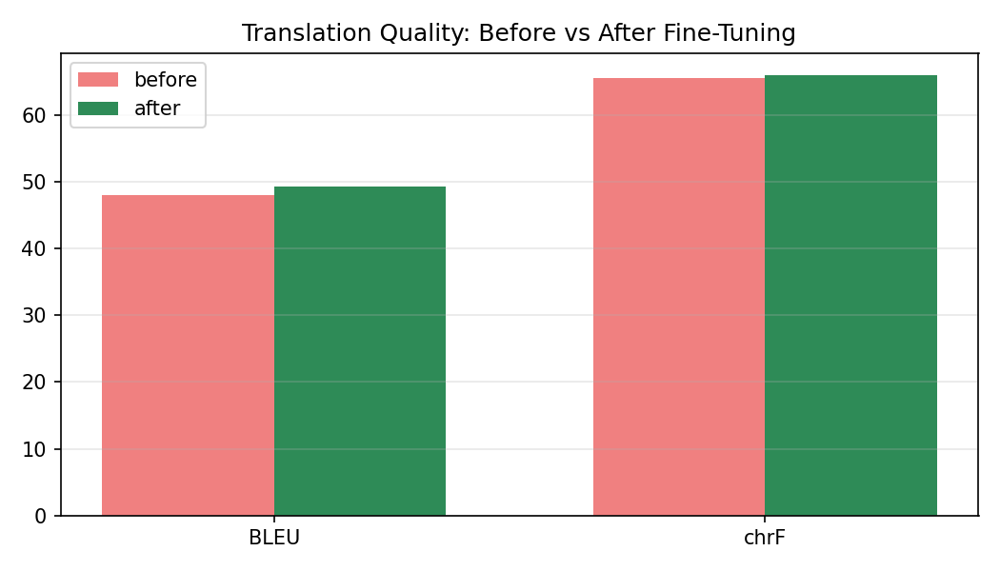
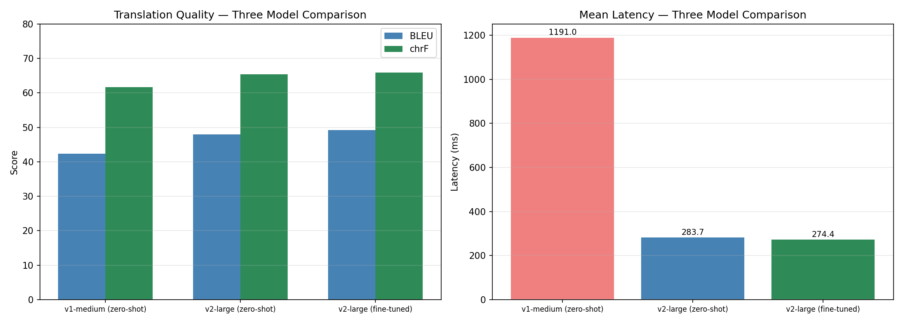
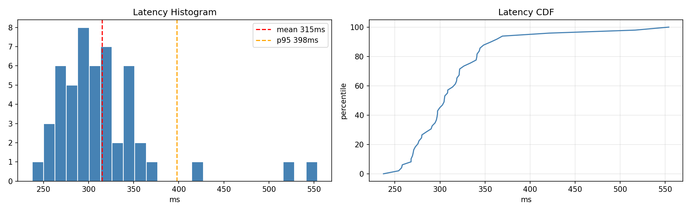
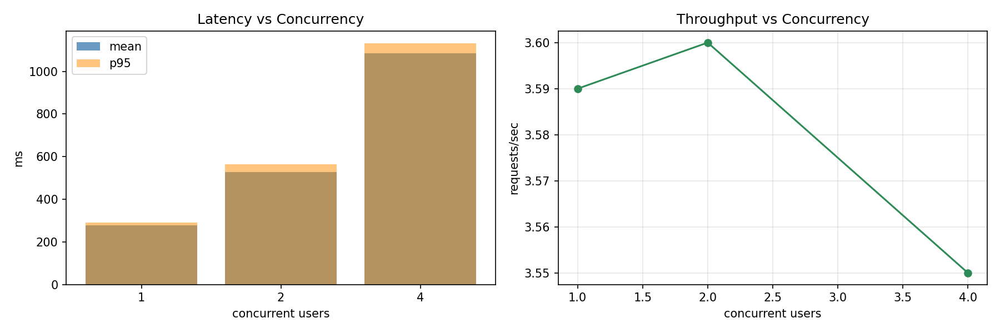
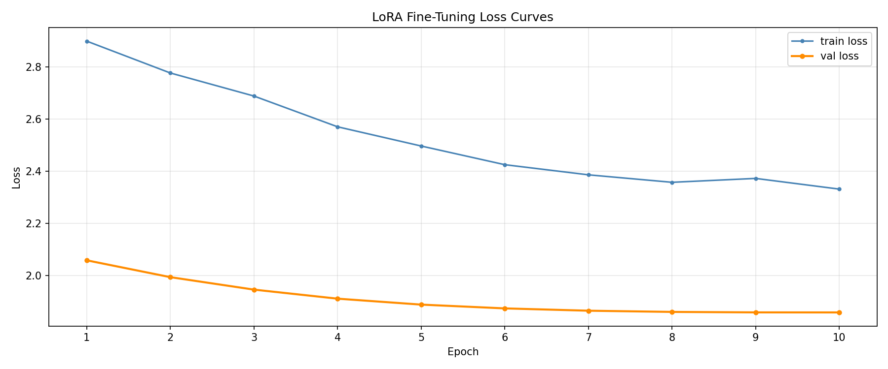
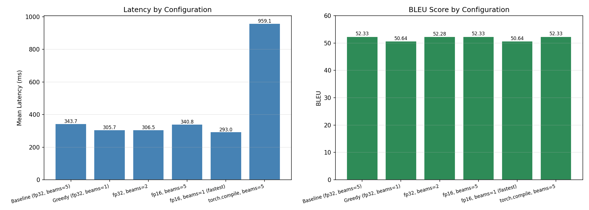

# Arabic-to-English Speech Translation

Real-time Arabic-to-English speech translation system fine-tuned with LoRA on SeamlessM4T-v2.
Designed for a customer-support use case: a human agent speaks Modern Standard Arabic (MSA)
and the customer hears the response in English speech.

- **Hugging Face model**: [hams-chadi/seamless-m4t-v2-arabic-english-lora](https://huggingface.co/hams-chadi/seamless-m4t-v2-arabic-english-lora)
- **GitHub repository**: [hams-chadi/hams-assessment](https://github.com/hams-chadi/hams-assessment)
- **Dataset (Google Drive)**: [Common Voice Arabic + CoVoST-2 TSV](https://drive.google.com/drive/folders/1BZ5XHI8h0tcM6LDMMO4u8i_wucIXszu7?usp=sharing)

---

## Table of Contents

1. [Project Overview](#project-overview)
2. [Dataset](#dataset)
3. [Fine-Tuning Method](#fine-tuning-method)
4. [Results](#results)
5. [Installation](#installation)
6. [Usage](#usage)
7. [Reproduction](#reproduction)
8. [Optimization](#optimization)
9. [Project Structure](#project-structure)
10. [Licenses](#licenses)
11. [Known Limitations](#known-limitations)
12. [Possible Improvements](#possible-improvements)
13. [Links](#links)

---

## Project Overview

This project implements a real-time Arabic-to-English speech translation system designed
for a customer-support use case: a human agent speaks Modern Standard Arabic (MSA) and the
customer hears the response in English speech.

### Selected Track

**Modern Standard Arabic (MSA) to English**

All dataset selection, fine-tuning, benchmarking, and demo are aligned to this track.

### Architecture

The system supports two inference modes:

**Mode 1 - S2TT + Kokoro TTS (fallback, lower latency)**
```
Arabic speech -> [Fine-tuned SeamlessM4T-v2 S2TT] -> English text -> [Kokoro TTS] -> English speech
```

**Mode 2 - Direct S2ST (end-to-end, uses build-in vocoder)**
```
Arabic speech -> [SeamlessM4T-v2 S2ST with fine-tuned weights] -> English speech
```

### Why SeamlessM4T

SeamlessM4T-v2 was selected because it translates Arabic speech to English in a single model,
with no separate ASR step and no LLM translation engine. This avoids the cascaded
Arabic STT -> LLM/MT -> TTS pipeline, which adds latency and error accumulation at each stage.

### Why Direct S2ST Was Not Fine-Tuned

Fine-tuning the full S2ST path requires a parallel Arabic speech to English speech dataset.
No suitable public dataset exists for this:

| Dataset | Type | Arabic Variety | License | Usable for S2ST fine-tuning |
|---|---|---|---|---|
| CVSS | S2S (synthetic English) | MSA | CC BY 4.0 | Partially - English is TTS-generated |
| CoVoST-2 | S2T | MSA | CC0 | No - text only, no English speech |
| TEDxTN | S2T | Tunisian | Public | No - dialectal, text only |
| ArzEn-ST | S2T (code-switch) | Egyptian | Public | No - text only |
| Ghadeer Corpus | ASR/TTS | Iraqi | Public | No - ASR only, dialectal |
| ZAEBUC-Spoken | ASR | Multi-dialect | Restricted | No - restricted access |

The S2ST path is therefore demonstrated using the SeamlessM4T built-in vocoder in zero-shot
mode. The fine-tuning effort is focused on the shared speech encoder and text decoder, which
are the translation quality bottleneck. The fine-tuned weights are applied to both the S2TT
and S2ST paths since they share the same backbone.

---

## Dataset

### Selected Dataset: CoVoST-2 (AR-EN)

CoVoST-2 is a large-scale multilingual speech translation corpus built on top of Mozilla
Common Voice. It provides Arabic speech audio paired with English text translations, making
it the most suitable available option for S2TT fine-tuning on MSA Arabic.

| Property | Value |
|---|---|
| Source | Mozilla Common Voice Arabic + CoVoST-2 translations |
| Task | Arabic speech to English text (S2TT) |
| Arabic variety | Modern Standard Arabic (MSA) |
| License | CC0 (public domain) |
| Train split | 1113 examples |
| Validation split | 300 examples |
| Test split | 300 examples |
| Mean audio duration | 3.37 seconds |
| Mean reference length | 6 words |

### Available Arabic-to-English Speech Datasets

| Dataset | Type | Arabic Variety | License | Notes |
|---|---|---|---|---|
| CVSS | S2S (synthetic English) | MSA | CC BY 4.0 | English speech is TTS-generated |
| CoVoST-2 | S2T | MSA | CC0 | Selected - public domain, MSA |
| TEDxTN | S2T | Tunisian | Public | Dialectal, not MSA |
| ArzEn-ST | S2T (code-switch) | Egyptian | Public | Dialectal, code-switching |
| Ghadeer Corpus | ASR/TTS | Iraqi | Public | ASR only, dialectal |
| ZAEBUC-Spoken | ASR | Multi-dialect | Restricted | Restricted access |

CoVoST-2 was selected because it is the only public, CC0-licensed dataset that provides MSA
Arabic speech paired with English text translations. All other options are either dialectal,
restricted, or lack English translations.

### Dataset Preparation

The dataset was assembled by joining two sources:

1. **CoVoST-2 TSV** (covost_v2.ar_en.tsv) - provides the filename, English translation, and split for each example
2. **Common Voice Arabic TSVs** (train.tsv, dev.tsv, test.tsv) - provides the Arabic sentence transcription for each filename

The join was performed on the audio filename. Only examples with matching entries in both
files and existing audio clips were kept, resulting in 2771 matched examples across all splits.

### Download Instructions

**Step 1 - Download Common Voice Arabic:**
```
https://commonvoice.mozilla.org/en/datasets
Select: Arabic, Version 25.0
```

**Step 2 - Download CoVoST-2 AR-EN TSV:**
```
https://github.com/facebookresearch/covost
File: covost_v2.ar_en.tsv
```

**Step 3 - Place files in the correct location:**
```
arabic_en_translation/
    data/
        covost_v2.ar_en.tsv
        common_voice_ar/
            clips/      <- MP3 audio files
            train.tsv
            dev.tsv
            test.tsv
```

A prepared copy of the dataset is also available on Google Drive (see the Links section).

### Preprocessing

Each audio example was processed as follows:

- **Audio loading**: MP3 files loaded via librosa, resampled to 16 kHz mono float32
- **Feature extraction**: AutoProcessor converts raw audio to log-mel input features (shape: time x 160 mel bins)
- **Label tokenization**: English reference text tokenized using the text_target= argument, truncated to 128 tokens
- **Padding**: a custom DataCollatorS2TT pads input features along the time axis and labels with -100 so the loss function ignores padding positions
- No audio normalization, noise reduction, or data augmentation was applied

### Dataset Limitations

- Sentences are short (mean 6 words) and clean - not representative of real customer support calls
- No dialectal Arabic coverage (Egyptian, Saudi, Moroccan)
- No background noise or hesitation words
- No mixed Arabic/English (code-switching) examples

---

## Fine-Tuning Method

### What Was Fine-Tuned

The fine-tuning targets the shared speech encoder and text decoder of SeamlessM4T-v2-large.
These are the components responsible for translation quality. The T2U decoder and HiFi-GAN
vocoder (used only in the S2ST path) were kept frozen since they process language-agnostic
English acoustic units and do not benefit from Arabic-specific adaptation.

### Method: LoRA (Low-Rank Adaptation)

LoRA was chosen over full fine-tuning for three reasons:
- The full model has 2.3B parameters - full fine-tuning would require significantly more VRAM
- LoRA produces a small adapter file (~25 MB) instead of a full checkpoint (~9 GB)
- LoRA prevents catastrophic forgetting of the pretrained multilingual knowledge

| LoRA Parameter | Value |
|---|---|
| Rank (r) | 16 |
| Alpha | 32 |
| Dropout | 0.05 |
| Target modules | q_proj, k_proj, v_proj, out_proj |
| Trainable parameters | ~7.8M / 1,813M (0.43%) |
| Task type | SEQ_2_SEQ_LM |

### Why Not Seq2SeqTrainer

The HuggingFace Seq2SeqTrainer with predict_with_generate=True is incompatible with
SeamlessM4T's generate() method. During evaluation, the trainer's internal generation calls
corrupted the decoder's learned distribution regardless of learning rate, causing the model
to collapse to empty output after training. A custom PyTorch training loop was used instead,
which gives full control over the forward pass and completely avoids this issue.

### Training Configuration

| Parameter | Value |
|---|---|
| Base model | facebook/seamless-m4t-v2-large |
| Training samples | 1113 |
| Validation samples | 300 |
| Epochs | 20 (two stages) |
| Stage 1 | 10 epochs at lr = 1e-5 |
| Stage 2 | 10 epochs at lr = 5e-6 |
| Batch size | 4 |
| Gradient accumulation | 4 (effective batch = 16) |
| Optimizer | AdamW, weight decay 0.01 |
| Scheduler | Cosine with warmup |
| Precision | fp16 on GPU |
| Hardware | GPU with 17 GB VRAM |
| Assessment target | NVIDIA L4 (24 GB) |
| Best validation loss | 1.86 |

### Training Strategy

The training used a two-stage learning rate schedule:
- Stage 1 starts at 1e-5 which is low enough to avoid the collapse seen with higher rates but high enough to move the weights meaningfully from the pretrained baseline
- Stage 2 continues from the Stage 1 checkpoint at 5e-6 for gentle refinement, reducing the validation loss from 2.09 to 1.86

A generation check was run after every epoch - the model's actual generate() output on a
fixed validation clip was printed so any collapse could be caught immediately rather than
discovered hours later.

---

## Results

### Translation Quality

Evaluated on 300 held-out test examples from CoVoST-2 AR-EN.

| Metric | Before (zero-shot) | After (fine-tuned) | Change |
|---|---|---|---|
| BLEU | 47.91 | 49.20 | +1.29 |
| chrF | 65.45 | 65.89 | +0.44 |
| COMET | 0.8864 | 0.8858 | -0.0006 |



BLEU and chrF improved after fine-tuning. COMET stayed flat - the semantic meaning was
already well preserved by the zero-shot model, and fine-tuning improved wording and fluency
rather than meaning.

### Three-Model Comparison

| Model | Parameters | Fine-tuned | BLEU | chrF | Mean latency (ms) |
|---|---|---|---|---|---|
| v1-medium (zero-shot) | 1.2B | No | 42.38 | 61.70 | 1191 |
| v2-large (zero-shot) | 2.3B | No | 47.91 | 65.45 | 283 |
| v2-large (fine-tuned) | 2.3B | Yes (LoRA) | 49.20 | 65.89 | 274 |



v1-medium was tested as a smaller model alternative. Despite having half the parameters of
v2-large, it was significantly slower (1191ms vs 283ms) due to the Conformer encoder being
less optimized in the HuggingFace transformers implementation, and it scored 6.82 BLEU points
lower. v2-large fine-tuned was selected as the production model.

### Human Evaluation

20 test examples were rated manually by a human reviewer on four dimensions (scale 1-5):

| Dimension | Mean Score |
|---|---|
| Meaning preservation | 4.50 / 5 |
| Fluency | 4.00 / 5 |
| Completeness | 4.60 / 5 |
| Serious mistranslations | 2 / 20 (10%) |

Notable observations:
- Sample 8: "Do you have it or not?" for "Do you have a lighter?" - hallucination, rated serious mistranslation
- Sample 17: "I like shaving" for "I love castles" - semantic error, rated serious mistranslation
- All other 18 examples scored 4 or 5 for meaning and completeness

### Error Analysis

Automatic error detection on 300 test examples:

| Error type | Count | Percentage |
|---|---|---|
| No errors detected | 282 | 94.0% |
| Negation flags | 18 | 6.0% |

Manual review of all 18 negation-flagged cases found 2 true errors (hallucinations), 15 false
positives (correct paraphrases with different negation wording), and 1 borderline case (wrong
pronoun). True error rate: 0.67% (2 out of 300 examples).

### Latency

Full pipeline latency (S2TT translation, batch size 1, GPU with 17 GB VRAM):

| Metric | Value |
|---|---|
| Mean latency | 315.1 ms |
| p50 latency | 304.7 ms |
| p95 latency | 397.9 ms |
| Max latency | 553.8 ms |
| Real-time factor (mean) | 0.085 |
| Real-time factor (p95) | 0.114 |



A real-time factor below 1.0 means the system translates faster than real time. At RTF 0.085,
the system translates a 3-second Arabic utterance in about 255ms.

### Concurrency

Thread-based concurrency test simulating multiple simultaneous users:

| Concurrent users | Mean latency (ms) | p95 latency (ms) | Throughput (req/s) | Failures |
|---|---|---|---|---|
| 1 | 276.7 | 291.8 | 3.59 | 0 |
| 2 | 528.9 | 563.7 | 3.60 | 0 |
| 4 | 1084.2 | 1132.6 | 3.55 | 0 |



Latency scales linearly with concurrency because requests queue on the GPU. Throughput stays
flat at ~3.6 requests/second across all levels, confirming the system is stable under load
with zero failures. For true parallel inference, a serving framework such as TorchServe or
Triton would be required.

---

## Installation

### Requirements

- Python 3.10+
- NVIDIA GPU with at least 10 GB VRAM (assessment target: NVIDIA L4 24 GB)
- CUDA 12.1+

### Setup

```bash
# Clone the repository
git clone https://github.com/hams-chadi/hams-assessment
cd hams-assessment

# Create a virtual environment
python -m venv venv

# Activate (Windows)
venv\Scripts\activate

# Activate (Linux/Mac)
source venv/bin/activate

# Install dependencies
pip install -r requirements.txt
```

### Download the Data

**Common Voice Arabic:**
```
https://commonvoice.mozilla.org/en/datasets
Select: Arabic, Version 25.0
Extract to: arabic_en_translation/data/common_voice_ar/
```

**CoVoST-2 AR-EN TSV:**
```
https://github.com/facebookresearch/covost
Download: covost_v2.ar_en.tsv
Place in: arabic_en_translation/data/
```

A prepared copy is also available on Google Drive (see Links section).

### Verify Installation

```python
import torch
print(torch.cuda.is_available())        # should print True
print(torch.cuda.get_device_name(0))    # should print your GPU name
```

---

## Usage

### Interactive Demo

A web demo allows you to upload Arabic audio or select a sample from the test set and receive
English translated speech.

```bash
cd arabic_en_translation
pip install gradio
python demo/app.py
```

Then open your browser at http://localhost:7860.

### CLI Inference (Single File)

```bash
cd arabic_en_translation
python scripts/infer.py --audio path/to/arabic_audio.wav
```

Expected output:
```json
{
  "translated_text": "I want to know the status of my order.",
  "output_audio": "output.wav",
  "latency_ms": {
    "time_to_first_text": 285,
    "time_to_first_audio": 343,
    "total_end_to_end": 343
  }
}
```

### Benchmarks

```bash
cd arabic_en_translation
python scripts/benchmark_quality.py --compare-zeroshot
python scripts/benchmark_latency.py
python scripts/benchmark_concurrency.py
```

---

## Reproduction

### Full Training Run from Scratch

**Step 1 - Download the data** (see Installation section)

**Step 2 - Open the main training notebook:**
```bash
cd arabic_en_translation
jupyter notebook arabic_english_speech_translation_fixed.ipynb
```

**Step 3 - Run sections in order:**

| Section | Description |
|---|---|
| Section 1 | Environment setup, imports, config |
| Section 2 | Dataset loading and exploration |
| Section 3 | Preprocessing and data collator |
| Section 4 | Zero-shot baseline evaluation |
| Section 5 | LoRA fine-tuning (custom training loop) |
| Section 6 | Reload and merge the adapter |
| Section 6b | SeamlessM4T v1-medium comparison (optional) |
| Section 7 | Before vs after evaluation (BLEU, chrF, COMET, human eval, error analysis) |
| Section 8 | Local TTS setup (Kokoro) |
| Section 9 | Full pipeline demo (S2TT + Kokoro) |
| Section 9b | 20-sample evaluation with increasing duration |
| Section 10 | Direct S2ST evaluation |
| Section 11 | Latency benchmarking |
| Section 12 | Concurrency benchmarking |
| Section 13 | Optimization experiments |
| Section 14 | Model card generation |

**Expected training time:**
- Stage 1 (10 epochs, lr=1e-5): approximately 60 minutes on a 17 GB VRAM GPU
- Stage 2 (10 epochs, lr=5e-6): approximately 60 minutes
- Total: approximately 2 hours

**Training configuration that produced BLEU 49.20:**

| Parameter | Value |
|---|---|
| Stage 1 learning rate | 1e-5 |
| Stage 2 learning rate | 5e-6 |
| Epochs per stage | 10 |
| Effective batch size | 16 |
| Best validation loss | 1.86 |



### Inference Only (No Retraining)

Download the adapter from Hugging Face:

```python
from peft import PeftModel
from transformers import SeamlessM4Tv2ForSpeechToText, AutoProcessor

model = SeamlessM4Tv2ForSpeechToText.from_pretrained(
    "facebook/seamless-m4t-v2-large"
)
model = PeftModel.from_pretrained(
    model, "hams-chadi/seamless-m4t-v2-arabic-english-lora"
)
model = model.merge_and_unload()
processor = AutoProcessor.from_pretrained(
    "hams-chadi/seamless-m4t-v2-arabic-english-lora"
)
```

### Important Notes for Reproducibility

- Restart the kernel between major sections to avoid GPU memory fragmentation
- When running Section 13 (optimization), load only the fine-tuned model before starting
- The test_set.json file must be exported from the notebook before running benchmark scripts
- Random seed is fixed at 42 for reproducible dataset splits and training

---

## Optimization

### Goal

Reduce end-to-end latency for real-time customer support use while maintaining acceptable
translation quality.

### Note on Evaluation

Optimization experiments were run on a clean GPU with only the fine-tuned model loaded. Each
configuration was loaded fresh, benchmarked on 50 test samples, then freed before the next.
BLEU scores differ from the Results section (52.33 vs 49.20) because the optimization used
the first 50 examples of the test set, which tend to be shorter and simpler than the full
300-sample set, explaining the higher score.

### 1. Beam Count Reduction

| Beams | Mean latency (ms) | p95 latency (ms) | BLEU | chrF | Peak VRAM (GB) |
|---|---|---|---|---|---|
| 5 (default) | 343.7 | 416.5 | 52.33 | 70.52 | 6.77 |
| 2 | 306.5 | 378.3 | 52.28 | 70.41 | 6.76 |
| 1 (greedy) | 305.7 | 386.7 | 50.64 | 69.02 | 6.77 |

**Finding:** beams=2 achieves almost the same speed as greedy (306.5ms vs 305.7ms) with
negligible quality loss (BLEU drop of only 0.05). Recommended for latency-sensitive deployments.

### 2. fp16 Inference

| Precision | Beams | Mean latency (ms) | p95 latency (ms) | BLEU | Peak VRAM (GB) |
|---|---|---|---|---|---|
| fp32 | 5 | 343.7 | 416.5 | 52.33 | 6.77 |
| fp16 | 5 | 340.8 | 420.5 | 52.33 | 4.81 |
| fp16 | 1 | 293.0 | 347.2 | 50.64 | 4.81 |

**Finding:** fp16 reduces VRAM by 29% (6.77 GB to 4.81 GB) with no quality loss. fp16 beams=1
is the fastest configuration at 293ms - 15% faster than the fp32 baseline.

### 3. torch.compile

| Configuration | Mean latency (ms) | p95 latency (ms) | BLEU | Peak VRAM (GB) |
|---|---|---|---|---|
| Baseline fp32 beams=5 | 343.7 | 416.5 | 52.33 | 6.77 |
| torch.compile fp32 beams=5 | 959.1 | 1561.1 | 52.33 | 7.82 |

**Finding:** torch.compile increased mean latency by 2.8x and peak VRAM by 16% on this
hardware. Translation quality was unchanged. torch.compile is not recommended for this model.

### 4. Smaller Model Variant (v1-medium, 1.2B)

| Model | Parameters | Mean latency (ms) | BLEU | chrF |
|---|---|---|---|---|
| v2-large (fine-tuned) | 2.3B | 315 | 49.20 | 65.89 |
| v1-medium (zero-shot) | 1.2B | 1191 | 42.38 | 61.70 |

**Finding:** despite having half the parameters, v1-medium was 3.8x slower and scored 6.82
BLEU points lower. v2-large is the better choice for both quality and speed.

### 5. Techniques Considered but Not Applied

| Technique | Reason not applied |
|---|---|
| ONNX export | Dynamic control flow in the decoder makes ONNX tracing non-trivial |
| TensorRT | Requires ONNX export as a prerequisite |
| BitsAndBytes INT8/INT4 | Requires specific CUDA kernels not available on all architectures |
| Streaming inference | SeamlessStreaming is a separate model family |
| Batching | Not applicable for real-time single-user customer support |

### Recommended Configuration

| Use case | Configuration | Mean latency | BLEU | Peak VRAM |
|---|---|---|---|---|
| Best quality | fp32, beams=5 | 343.7ms | 52.33 | 6.77 GB |
| Best speed, no quality loss | fp32, beams=2 | 306.5ms | 52.28 | 6.76 GB |
| Lowest memory | fp16, beams=5 | 340.8ms | 52.33 | 4.81 GB |
| Fastest overall | fp16, beams=1 | 293.0ms | 50.64 | 4.81 GB |




---

## Project Structure

```
arabic_en_translation/
├── README.md
├── requirements.txt
├── model_card.md
├── test_set.json
│
├── data/
│   ├── covost_v2.ar_en.tsv
│   └── common_voice_ar/
│       ├── clips/
│       ├── train.tsv
│       ├── dev.tsv
│       └── test.tsv
│
├── scripts/
│   ├── infer.py
│   ├── benchmark_quality.py
│   ├── benchmark_latency.py
│   └── benchmark_concurrency.py
│
├── demo/
│   ├── app.py
│   └── sample_audio/
│
├── checkpoints/
│   └── lora_s2tt/
│       ├── best_adapter/
│       └── processor/
│
├── results/
│   ├── before_after_comparison.csv
│   ├── full_model_comparison.csv
│   ├── latency_report.json
│   ├── concurrency_report.csv
│   ├── optimization_results.csv
│   ├── error_analysis.csv
│   ├── human_eval_template.csv
│   ├── training_history.json
│   └── 20sample_eval.json
│
├── audio_outputs/
│
└── notebooks/
    ├── arabic_english_speech_translation_fixed.ipynb
    └── eval_20samples.ipynb
```

---

## Licenses

| Component | Name | License | Commercial Use |
|---|---|---|---|
| Speech translation model | facebook/seamless-m4t-v2-large | CC BY-NC 4.0 | No |
| Fine-tuning method | PEFT / LoRA (HuggingFace) | Apache 2.0 | Yes |
| Dataset | CoVoST-2 (ar_en) | CC0 | Yes |
| Audio source | Mozilla Common Voice Arabic | CC0 | Yes |
| TTS | Kokoro | Apache 2.0 | Yes |
| ASR evaluation | OpenAI Whisper base | MIT | Yes |
| Metrics | sacrebleu | Apache 2.0 | Yes |
| Metrics | unbabel-comet | Apache 2.0 | Yes |
| Framework | PyTorch | BSD 3-Clause | Yes |
| Framework | HuggingFace Transformers | Apache 2.0 | Yes |

### Commercial Use Warning

The base model (facebook/seamless-m4t-v2-large) is licensed under CC BY-NC 4.0, which
explicitly restricts commercial use. This system is intended for research and evaluation
purposes only. For a commercial deployment, the base model would need to be replaced with
a permissively licensed alternative.

---

## Known Limitations

### Language Coverage
- Trained exclusively on Modern Standard Arabic (MSA). Dialectal Arabic (Saudi, Egyptian, Moroccan, Iraqi) will produce significantly degraded results.
- Code-switching (mixed Arabic and English sentences) may leave some words untranslated.

### Dataset Limitations
- CoVoST-2 sentences are short (mean 6 words) and clean - not representative of real customer support calls.
- No background noise, hesitation words, or filler sounds in training data.
- No customer-support-specific vocabulary (prices, order numbers, product names).

### Model Limitations
- Non-streaming: the system waits for the complete Arabic utterance before starting translation.
- Long utterances beyond approximately 30 seconds may be truncated.
- Heavy background noise significantly reduces translation accuracy.
- The model occasionally hallucinates on specific out-of-domain vocabulary (0.67% true error rate).
- COMET semantic score did not improve after fine-tuning (0.8864 -> 0.8858).

### Deployment Limitations
- The base model (CC BY-NC 4.0) restricts commercial use.
- Minimum 10 GB VRAM required for inference.
- torch.compile is not beneficial on this hardware configuration.
- No true parallel inference - concurrent requests queue on the GPU.

### S2ST Limitations
- The direct S2ST path uses the zero-shot SeamlessM4T vocoder. Fine-tuning was not possible due to the absence of a public Arabic-to-English speech-to-speech parallel dataset.
- The voice and speech naturalness of the S2ST output are fixed by the pretrained vocoder.

---

## Possible Improvements

### Data
- **More training data**: the full CoVoST-2 Arabic split contains approximately 230,000 examples.
- **Dialectal Arabic coverage**: adding Saudi, Egyptian, or Moroccan Darija data.
- **Customer support domain data**: fine-tuning on domain-specific call center recordings.
- **Data augmentation**: adding background noise and room reverb to training audio.
- **Synthetic data**: using a TTS system to generate additional Arabic speech from text.

### Model
- **QLoRA (4-bit quantization)**: reduce training memory for larger batch sizes.
- **Full fine-tuning of more layers**: including feed-forward layers or the speech encoder.
- **SeamlessM4T v2 medium**: if Meta releases a v2 medium checkpoint.

### Latency
- **ONNX export**: reduce inference latency without quality loss.
- **TensorRT**: further reduce latency on NVIDIA GPUs.
- **Streaming inference**: replace with SeamlessStreaming for partial output before the utterance ends.
- **Chunked audio processing**: split long utterances into overlapping chunks.
- **INT8 quantization**: reduce both memory and latency with minimal quality impact.

### Deployment
- **TorchServe or Triton**: production-grade model serving for batching concurrent requests.
- **CPU optimization**: ONNX Runtime with CPU execution providers for CPU-only machines.

### S2ST Quality
- **CVSS dataset**: fine-tune the T2U decoder and vocoder on the CVSS corpus.
- **Custom vocoder**: train a HiFi-GAN vocoder on a target English voice.

---

## Links

### Model
- **Hugging Face model**: [hams-chadi/seamless-m4t-v2-arabic-english-lora](https://huggingface.co/hams-chadi/seamless-m4t-v2-arabic-english-lora)

### Code
- **GitHub repository**: [hams-chadi/hams-assessment](https://github.com/hams-chadi/hams-assessment)

### Data
- **Dataset (Google Drive)**: [Common Voice Arabic + CoVoST-2 TSV](https://drive.google.com/drive/folders/1BZ5XHI8h0tcM6LDMMO4u8i_wucIXszu7?usp=sharing)

The Google Drive folder contains covost_v2.ar_en.tsv and the common_voice_ar/ audio clips
and TSV files. The dataset is CC0 licensed (public domain).

### Demo Video
- **Demo video**: [demo/demo_hams_assessment.mp4](demo/demo_hams_assessment.mp4)
